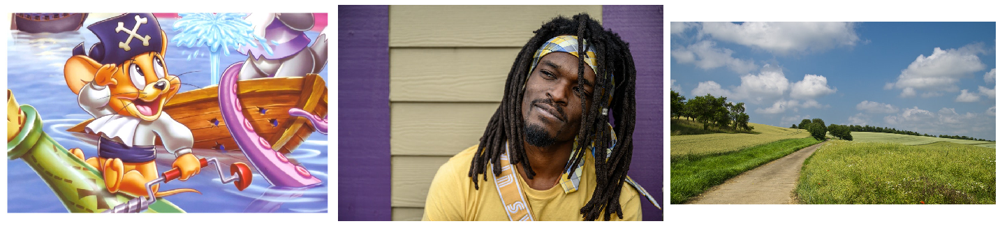
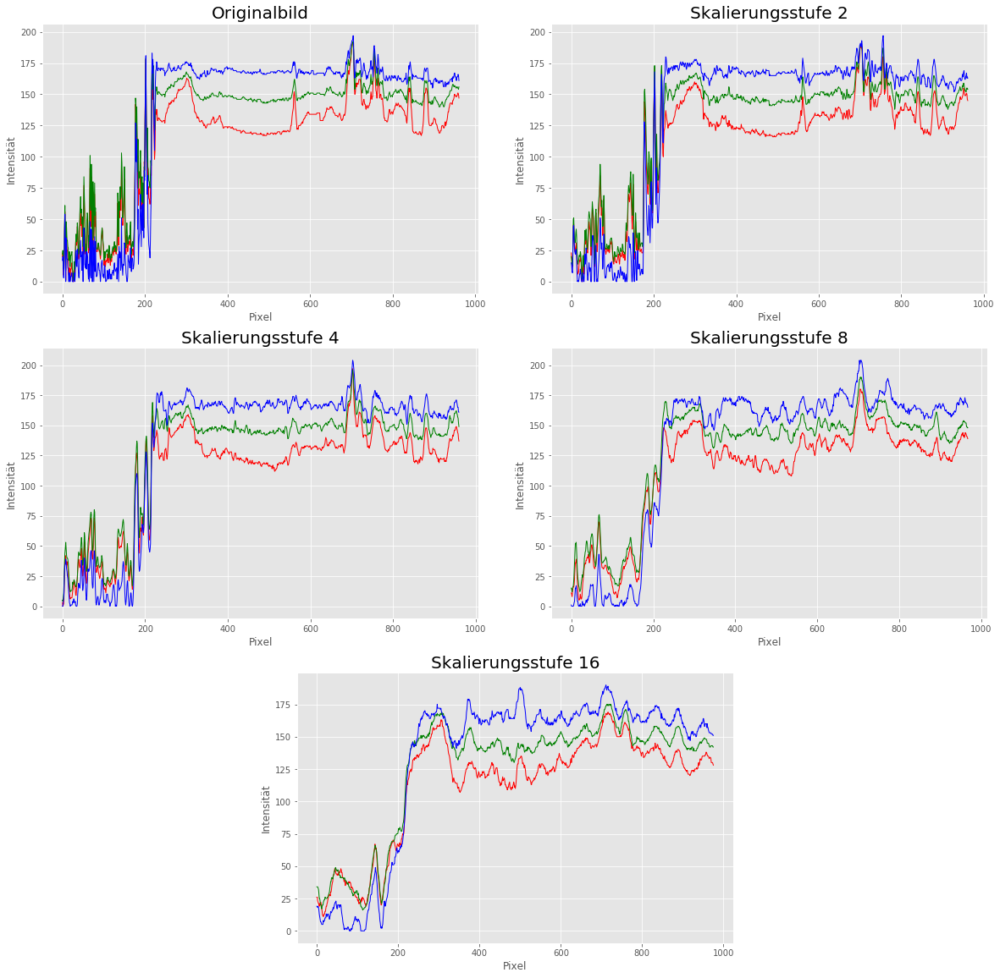
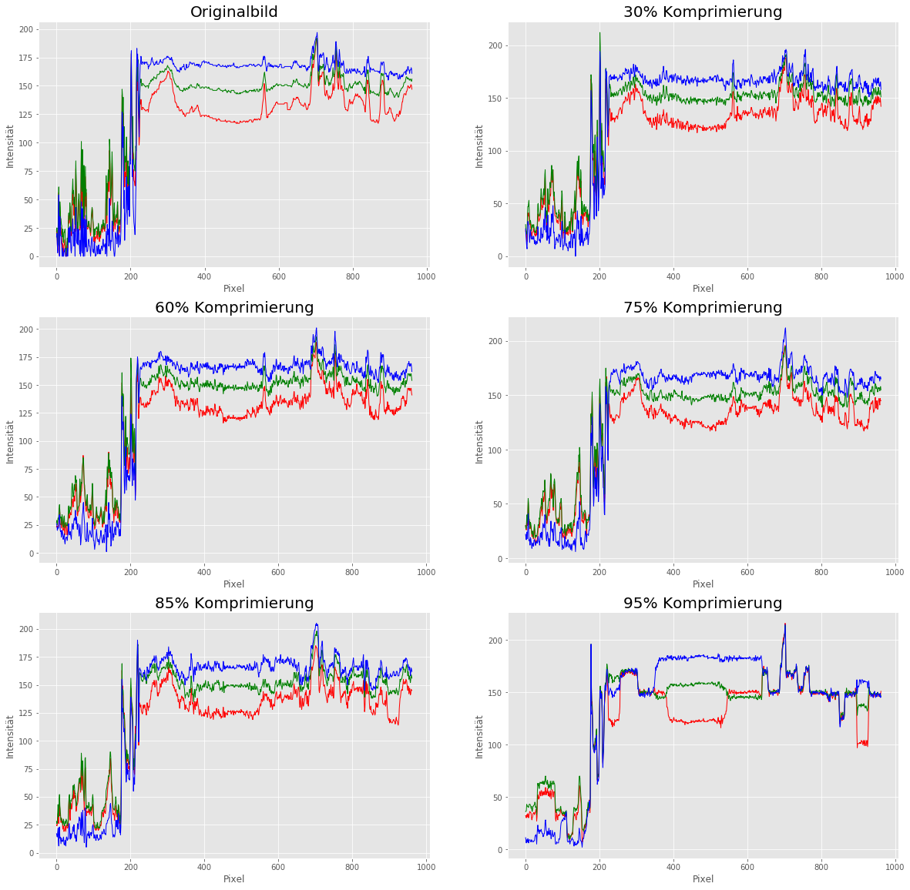

# Auswirkungen der Image-Superresolution auf die Bildqualität

### Gabriel Dogadov, Rasmy Hamdad, Mhamad Ayden, Alex Frank

## 1. Einleitung
Machine Learning ist gerade vallah krass und besonders für Computer Vision richtig mashallah


### Hypothesen

1. Bei kleinen Vergrößerungs- und Komprimierungsstufen ist ein Qualitätsunterschied kaum wahrnehmbar.

2. Bei größeren Vergrößerungs- und Komprimierungsstufen verschlechtert sich die Bildqualität spürbar.


## 2. Experimentelles Design

Die <a href="https://github.com/idealo/image-super-resolution" target="_blank">Idealo Super-Resolution Library</a> bietet unterschiedliche Typen von Neuronalen Netzwerken an, welche neben der Skalierung auch Entfernung von Noise anbieten. 

#### Unsere Bilder


<div style="display:flex" class="text-center">
    <div>
        
    </div>
</div>
<div>
      <div>Bildquelle Cartoon: <a href="https://www.wallpapertip.com/wpic/obwwTm_cute-cartoon-wallpaper-backgrounds-tom-and-jerry/">https://www.wallpapertip.com/wpic/obwwTm_cute-cartoon-wallpaper-backgrounds-tom-and-jerry/</a></div>
      <div>Bildquelle Gesicht: <a href="https://www.pexels.com/photo/man-in-yellow-crew-neck-t-shirt-4001263/"> https://www.pexels.com/photo/man-in-yellow-crew-neck-t-shirt-4001263/</a>
      </div>
      <div>Bildquelle Landschaft: <a href="https://www.pexels.com/photo/pathway-in-between-of-green-grass-field-67211/">https://www.pexels.com/photo/pathway-in-between-of-green-grass-field-67211</a>
      </div>
</div>

### JPEG Komprimierung der Bilder mittels PIL

```python
from PIL import Image

rates = [30, 60, 75, 85, 95] # Compression rates

def save_compressed(img, directory):
    """
    Speichert das Bild in verschiedenen Komprimierungsstufen
    
    Parameter
    ---------
    img : Image
        Das Bild, welches komprimiert werden soll
    directory : str
        Pfad, in dem die komprimierten Bilder hinterlegt werden sollen
    
    """
    
    for rate in rates:
        quality = 100 - rate
        img.save("{}/{}.jpg".format(directory, rate), "JPEG", quality=quality)

img = Image.open("PATH_TO_IMG")
save_compressed(face, "PATH_TO_FOLDER_WITH_IMAGES")
```

### Image Superresolution mit der <a href="https://github.com/idealo/image-super-resolution" target="_blank">Idealo ISR Library</a>

```python
import numpy as np
from PIL import Image
from ISR.models import RDN

def scale_up(rdn, directory):
    """
    Upscaling für die Bilder in verschiedenen Stufen (x2, x4, x8, x16)
    
    Parameter
    ---------
    rdn : RDN
        Trainiertes Neuronales Netzwerk
    directory : str
        Pfad zum Ordner mit den Bildern
    
    """
    
    for i in range(1, 5):
        factor = 2**i
        current_image = np.array(Image.open("{}/x{}.jpg".format(directory, factor)))
        for j in range(i):
            current_image = rdn.predict(current_image)
        Image.fromarray(current_image).save("{}/x{}_scaled.jpg".format(directory, factor), "JPEG", quality=100)

def scale_up2(rdn, directory, rates):
    """
    Upscaling für die Bilder (x2) mit Noise-Cancellation
    
    Parameter
    ---------
    rdn : RDN
        Trainiertes Neuronales Netzwerk
    directory : str
        Pfad zum Ordner mit den Bildern
    rates : list
        Liste mit Komprimierungsstufen als Ganzzahl (0-100)
    
    """
    
    for rate in rates:
        current_image = np.array(Image.open("{}/{}.jpg".format(directory, rate)))
        current_image = rdn.predict(current_image)
        Image.fromarray(current_image).save("{}/{}_scaled.jpg".format(directory, rate), "JPEG", quality=100)
        
rdn = RDN(weights='psnr-small') # Nur Upscaling
rdn2 = RDN(weights='noise-cancel') # Upscaling + Noise cancellation
        
scale_up(rdn, "PATH_TO_FOLDER_WITH_IMAGES")
scale_up2(rdn2, "PATH_TO_FOLDER_WITH_IMAGES", rates = [30, 60, 75, 85, 95])
   
```

## 3. Ergebnisse

Alles wie geplant

#### Horizontal Cut (Landschaft)


Und hier noch einmal für alle Komprimierungsstufen nach Anwendung der Super-Resolution:



## 4. Diskussion
Dass Samy schwul ist, steht nicht zur Diskussion

## 5. Anhang

### Unsere Bilder

<table class="table">
    <tr>
        <th style="text-align:center"></th>
        <th style="text-align:center">Cartoon</th>
        <th style="text-align:center">Gesicht</th>
        <th style="text-align:center">Landschaft</th>
    </tr>
    <tr>
        <td style="text-align:center">Original</td>
        <td style="text-align:center"><a href="images/cartoon/original.jpg">Zum Bild</a></td>
        <td style="text-align:center"><a href="images/face/original.jpg">Zum Bild</a></td>
        <td style="text-align:center"><a href="images/landscape/original.jpg">Zum Bild</a></td>
    </tr>
    <tr>
        <td style="text-align:center">Skalierungsstufe 2</td>
        <td style="text-align:center"><a href="images/cartoon/x2_scaled.jpg">Zum Bild</a></td>
        <td style="text-align:center"><a href="images/face/x2_scaled.jpg">Zum Bild</a></td>
        <td style="text-align:center"><a href="images/landscape/x2_scaled.jpg">Zum Bild</a></td>
    </tr>
    <tr>
        <td style="text-align:center">Skalierungsstufe 4</td>
        <td style="text-align:center"><a href="images/cartoon/x4_scaled.jpg">Zum Bild</a></td>
        <td style="text-align:center"><a href="images/face/x4_scaled.jpg">Zum Bild</a></td>
        <td style="text-align:center"><a href="images/landscape/x4_scaled.jpg">Zum Bild</a></td>
    </tr>
    <tr>
        <td style="text-align:center">Skalierungsstufe 8</td>
        <td style="text-align:center"><a href="images/cartoon/x8_scaled.jpg">Zum Bild</a></td>
        <td style="text-align:center"><a href="images/face/x8_scaled.jpg">Zum Bild</a></td>
        <td style="text-align:center"><a href="images/landscape/x8_scaled.jpg">Zum Bild</a></td>
    </tr>
    <tr>
        <td style="text-align:center">Skalierungsstufe 16</td>
        <td style="text-align:center"><a href="images/cartoon/x16_scaled.jpg">Zum Bild</a></td>
        <td style="text-align:center"><a href="images/face/x16_scaled.jpg">Zum Bild</a></td>
        <td style="text-align:center"><a href="images/landscape/x16_scaled.jpg">Zum Bild</a></td>
    </tr>
    <tr>
        <td style="text-align:center">30% Komprimierung</td>
        <td style="text-align:center"><a href="images/cartoon/30_scaled.jpg">Zum Bild</a></td>
        <td style="text-align:center"><a href="images/face/30_scaled.jpg">Zum Bild</a></td>
        <td style="text-align:center"><a href="images/landscape/30_scaled.jpg">Zum Bild</a></td>
    </tr>
    <tr>
        <td style="text-align:center">60% Komprimierung</td>
        <td style="text-align:center"><a href="images/cartoon/60_scaled.jpg">Zum Bild</a></td>
        <td style="text-align:center"><a href="images/face/60_scaled.jpg">Zum Bild</a></td>
        <td style="text-align:center"><a href="images/landscape/60_scaled.jpg">Zum Bild</a></td>
    </tr>
    <tr>
        <td style="text-align:center">75% Komprimierung</td>
        <td style="text-align:center"><a href="images/cartoon/75_scaled.jpg">Zum Bild</a></td>
        <td style="text-align:center"><a href="images/face/75_scaled.jpg">Zum Bild</a></td>
        <td style="text-align:center"><a href="images/landscape/75_scaled.jpg">Zum Bild</a></td>
    </tr>
    <tr>
        <td style="text-align:center">85% Komprimierung</td>
        <td style="text-align:center"><a href="images/cartoon/85_scaled.jpg">Zum Bild</a></td>
        <td style="text-align:center"><a href="images/face/85_scaled.jpg">Zum Bild</a></td>
        <td style="text-align:center"><a href="images/landscape/85_scaled.jpg">Zum Bild</a></td>
    </tr>
    <tr>
        <td style="text-align:center">95% Komprimierung</td>
        <td style="text-align:center"><a href="images/cartoon/95_scaled.jpg">Zum Bild</a></td>
        <td style="text-align:center"><a href="images/face/95_scaled.jpg">Zum Bild</a></td>
        <td style="text-align:center"><a href="images/landscape/95_scaled.jpg">Zum Bild</a></td>
    </tr>
    <tr>
        <td style="text-align:center">Horizontal Cut (verschiedene Skalierungsstufen)</td>
        <td style="text-align:center"><a href="images/cartoon/horizontal_cut_scaling.png">Zum Bild</a></td>
        <td style="text-align:center"><a href="images/face/horizontal_cut_scaling.png">Zum Bild</a></td>
        <td style="text-align:center"><a href="images/landscape/horizontal_cut_scaling.png">Zum Bild</a></td>
    </tr>
    <tr>
        <td style="text-align:center">Horizontal Cut (verschiedene Komprimierungsstufen)</td>
        <td style="text-align:center"><a href="images/cartoon/horizontal_cut_compression.png">Zum Bild</a></td>
        <td style="text-align:center"><a href="images/face/horizontal_cut_compression.png">Zum Bild</a></td>
        <td style="text-align:center"><a href="images/landscape/horizontal_cut_compression.png">Zum Bild</a></td>
    </tr>
</table>
