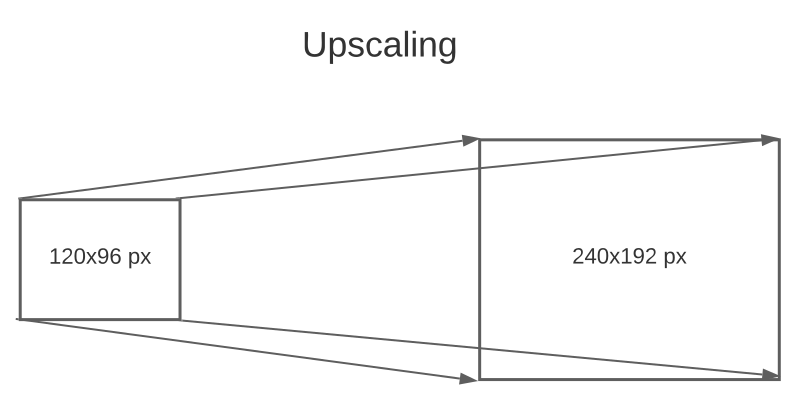
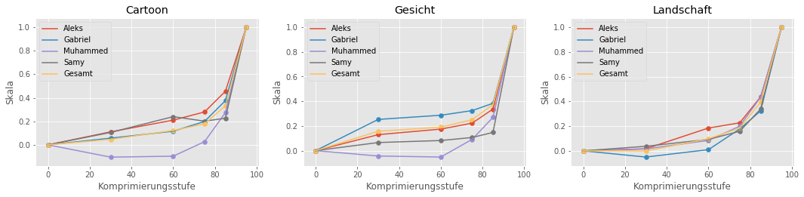

# Auswirkungen der Image-Superresolution auf die Bildqualität

### Gabriel Dogadov, Rasmy Hamdad, Mhamad Ayden, Alex Frank

## 1. Einleitung


In den letzten Jahren ist ein starker Fortschritt im Machine Learning zu verzeichnen. Ein Grund dafür sind neuronale Netzwerke, welche sich als sehr mächtig und vielfältig herausgestellt haben. Vor allem für <a href="https://de.wikipedia.org/wiki/Computer_Vision#:~:text=Im%20englischen%20Sprachraum%20wird%20ebenfalls,im%20industriellen%20Umfeld%20betont%20wird.">Computer Vision</a> sind <a href="https://de.wikipedia.org/wiki/Convolutional_Neural_Network">Convolutional Neural Networks</a> vielfältig einsetzbar. Eine vielversprechende Anwendung hierbei ist die Super-Resolution, bei der die Auflösung von Bildern (also die Anzahl der Pixel) stark vergrößert wird.

Das Vergrößern (Upscaling) von Bildern kann sehr nützlich sein. Statt hochauflösende Bilder zu erstellen, könnte man stattdessen kleine Bilder bequem mit Super-Resolution hochskalieren.



Beim Hochskalieren werden meist kleine Bilder auf größere Bilder mit deutlich mehr Pixeln abgebildet. Es reicht nicht die Pixelwerte vom Originalbild in das skalierte Bild zu kopieren. Es bleiben weitere Pixel übrig, denen man Werte zuweisen muss.

Eine herkömmliche Methode zum Füllen der Pixel bei vergrößerten Bildern ist die <a href="https://en.wikipedia.org/wiki/Bicubic_interpolation">Bikubische Interpolation</a>. Das Verfahren erzeugt aber häufig unscharfe Bilder, sodass die Bildqualität nach dessen Anwendung darunter leidet. Eine Lösung für dieses Problem soll die Image Super-Resolution liefern. Dazu wird ein neuronales Netzwerk darauf trainiert, Bilder unterschiedlicher Größen so zu vergrößern, dass die Bildqualität erhalten bleibt.

In diesem Bild sieht man ein um den Faktor 4 vergrößertes Bild. Die bikubische Interpolation liefert ein unscharfes Bild, wohingegen SRResNet und SRGAN, welche auf neuronalen Netzen basieren, deutlich bessere Ergebnisse liefern. 


Das Bild wurde aus Ledig et al. (2017) entnommen.

Zwar ist das Verfahren noch sehr jung, trotzdem gibt es bereits kommerzielle Anbieter
(<a href="https://bigjpg.com/">Bigjpg</a>, <a href="https://letsenhance.io/">LetsEnhance.io</a>, 
 <a href="https://deepai.org/machine-learning-model/torch-srgan">DeepAI</a>), 
die versprechen unsere Bilder ohne jegliche Qualitätsverluste hoch zu skalieren. Diesem Versprechen möchten wir im Folgenden auf den Grund gehen.<br>
Neben der reinen Hochskalierung gibt es zusätzlich die Möglichkeit Noise von Bildern zu entfernen. Die Noise Cancellation kann also dafür sorgen, dass nicht nur die Bilder ohne Qualitätsverlust vergrößert werden, sondern auch die Bildqualität durch das Entfernen von Noise verbessert wird.

Das führt uns zu unserer Fragestellung, der wir auf den Grund gehen wollen: __Wie verändert sich die Bildqualität nach Anwendung der Super-Resolution?__

Statt jeden Anbieter einzeln zu testen, testen wir die Super-Resolution mit der <a href="https://github.com/idealo/image-super-resolution" target="_blank">Idealo Super-Resolution Library</a>. Wir untersuchen hierbei die Möglichkeiten und Grenzen des Verfahrens.<br>
Die <a href="https://github.com/idealo/image-super-resolution" target="_blank">Idealo Super-Resolution Library</a> bietet unterschiedliche Typen von neuronalen Netzwerken an, welche neben der Skalierung auch Noise Cancellation durchführen. Die Library bietet die Möglichkeit ein neuronales Netzwerk selbst zu trainieren oder ein bereits trainiertes zu verwenden. Die vortrainierten Netzwerke kommen mit unterschiedlichen Gewichten, wobei wir keine Gewichte speziell ausgewählt haben, sondern die Standardeinstellung übernommen haben.

Wir testen die Super-Resolution dann auf zwei verschiedene Weisen. Im ersten Experiment untersuchen wir die Bildqualität in Abhängigkeit von der Vergrößerungsstufe. Wir testen die Stufen x2, x4, x8 und x16 aus, wobei x2 bedeutet, dass sowohl Höhe als auch Breite um den Faktor 2 skaliert wird. Die tatsächliche Anzahl der Pixel wird hierbei auf das 4-fache erhöht.<br>
Zum Testen der Noise Cancellation skalieren wir die Bilder stets um den Faktor 2 (also die Anzahl der Pixel vervierfacht sich), aber vorher werden die Bilder mit JPEG komprimiert. Wir nutzen die Komprimierungsstufen 30%, 60%, 75%, 85% und 95% (die Komprimierungsstufe ist 100 - Quality-Parameter in PIL). Unsere Komprimierungsstufen sind nicht gleichmäßig verteilt, da kleine Komprimierungen oftmals kaum sichtbar sind. So können wir mehr hohe Komprimierungsstufen austesten und genauer ermitteln, ab welcher Komprimierung sich das Originalbild nicht mehr in guter Qualität wiederherstellen lässt.

Nach einigen Versuchen konnten wir beobachten, dass die Bildqualität bei großen Vergrößerungsfaktoren sowie hohen Komprimierungen sich wahrnehmbar verschlechtert und formulierten unsere Hypothesen wie folgt:

### Hypothesen

1. Bei kleinen Vergrößerungs- und Komprimierungsstufen ist ein Qualitätsunterschied kaum wahrnehmbar.

2. Bei größeren Vergrößerungs- und Komprimierungsstufen verschlechtert sich die Bildqualität spürbar.


## 2. Experimentelles Design

Für das Experiment wurden drei unterschiedliche Bilder verwendet: Ein Bild aus einem Cartoon mit kräftigen Farben, ein Gesichtsbild sowie eine Landschaft. Die drei unterschiedlichen Bildtypen kommen daher zustande, dass eventuell Unterschiede abhängig vom Typus des Bildes zustande kommen können. Zunächst wissen wir nicht mit welchen Bildern das neuronale Netz trainiert wurde. Abhängig von den Trainingsdaten können immense Unterschiede auftreten. Zudem kann das Bild selbst von Bedeutung sein, wie zum Beispiel die Farben oder die Anordnung der Pixel.

#### Unsere Bilder (verkleinert)


<div style="display:flex" class="text-center">
    <div>
        
    </div>
</div>
<div>
      <div>Bildquelle Cartoon: <a href="https://www.wallpapertip.com/wpic/obwwTm_cute-cartoon-wallpaper-backgrounds-tom-and-jerry/">https://www.wallpapertip.com/wpic/obwwTm_cute-cartoon-wallpaper-backgrounds-tom-and-jerry/</a></div>
      <div>Bildquelle Gesicht: <a href="https://www.pexels.com/photo/man-in-yellow-crew-neck-t-shirt-4001263/"> https://www.pexels.com/photo/man-in-yellow-crew-neck-t-shirt-4001263/</a>
      </div>
      <div>Bildquelle Landschaft: <a href="https://www.pexels.com/photo/pathway-in-between-of-green-grass-field-67211/">https://www.pexels.com/photo/pathway-in-between-of-green-grass-field-67211</a>
      </div>
</div>

Die Originalbilder in der Originalgröße sind im Anhang verlinkt.

Da die Super-Resolution darauf abzielt, große Bilder zu erzeugen, wollten wir möglichst große Bilder vergleichen, die aber auf einen Full-HD (1920x1080px) Bildschirm passen. Um dies zu erreichen, haben wir unsere Originalbilder mit den Größen 961x540px, 856x540px und 812x540px künstlich verkleinert und im Nachhinein versucht sie möglichst gut wiederherzustellen.<br>
Zunächst wurden unsere Originalbilder verkleinert, sodass sowohl Länge als auch Breite um die Faktoren 2, 4, 8 bzw. 16 verkleinert werden. Zusätzlich wurden die Bilder, dessen Länge und Breite halbiert wurden, mittels JPEG Komprimierung komprimiert. Anschließend wurden Bilder mit Super-Resolution und ggf. Noise Cancellation wieder hochskaliert und mit dem Originalbild mittels Maximum Likelihood Difference Scaling (MLDS) wie bei Charrier et al. (2007) verglichen.<br>
Da MLDS keine direkte Skala für die Bildqualität darstellt, gehen wir davon aus, dass das Originalbild stets die beste Bildqualität hat. Diese Annahme bewahrheitet sich im Folgenden für höhere Skalierungs- bzw. Komprimierungsstufen. 


### JPEG Komprimierung der Bilder mittels PIL

```python
from PIL import Image

rates = [30, 60, 75, 85, 95] # Compression rates

def save_compressed(img, directory):
    """
    Speichert das Bild in verschiedenen Komprimierungsstufen
    
    Parameter
    ---------
    img : Image
        Das Bild, welches komprimiert werden soll
    directory : str
        Pfad, in dem die komprimierten Bilder hinterlegt werden sollen
    
    """
    
    for rate in rates:
        quality = 100 - rate
        img.save("{}/{}.jpg".format(directory, rate), "JPEG", quality=quality)

img = Image.open("PATH_TO_IMG")
save_compressed(face, "PATH_TO_FOLDER_WITH_IMAGES")
```

### Image Superresolution mit der <a href="https://github.com/idealo/image-super-resolution" target="_blank">Idealo ISR Library</a>

```python
import numpy as np
from PIL import Image
from ISR.models import RDN

def scale_up(rdn, directory):
    """
    Upscaling für die Bilder in verschiedenen Stufen (x2, x4, x8, x16)
    
    Parameter
    ---------
    rdn : RDN
        Trainiertes Neuronales Netzwerk
    directory : str
        Pfad zum Ordner mit den Bildern
    
    """
    
    for i in range(1, 5):
        factor = 2**i
        current_image = np.array(Image.open("{}/x{}.jpg".format(directory, factor)))
        for j in range(i):
            current_image = rdn.predict(current_image)
        Image.fromarray(current_image).save("{}/x{}_scaled.jpg".format(directory, factor), "JPEG", quality=100)

def scale_up2(rdn, directory, rates):
    """
    Upscaling für die Bilder (x2) mit Noise-Cancellation
    
    Parameter
    ---------
    rdn : RDN
        Trainiertes Neuronales Netzwerk
    directory : str
        Pfad zum Ordner mit den Bildern
    rates : list
        Liste mit Komprimierungsstufen als Ganzzahl (0-100)
    
    """
    
    for rate in rates:
        current_image = np.array(Image.open("{}/{}.jpg".format(directory, rate)))
        current_image = rdn.predict(current_image)
        Image.fromarray(current_image).save("{}/{}_scaled.jpg".format(directory, rate), "JPEG", quality=100)
        
rdn = RDN(weights='psnr-small') # Nur Upscaling
rdn2 = RDN(weights='noise-cancel') # Upscaling + Noise cancellation
        
scale_up(rdn, "PATH_TO_FOLDER_WITH_IMAGES")
scale_up2(rdn2, "PATH_TO_FOLDER_WITH_IMAGES", rates = [30, 60, 75, 85, 95])
   
```

### Maximum Likelihood Difference Scaling

Die Bilder wurden mit MLDS verglichen: Der Experimentator bekam drei Bilder gleichzeitig angezeigt, wovon zwei Bilder oben in einer Reihe und das dritte Bild unten alleine angezeigt wurde. Der Experimentator musste entscheiden, welches der beiden oberen Bilder dem Bild unten weniger ähnlich sieht. Das MLDS Experiment mit Triaden wurde von jeder Versuchsperson fünf mal durchgeführt.

Im ersten Teilexperiment wurden die Skalierungsstufen (x2, x4, x8, x16) variiert und es wurde keine Komprimierung verwendet. Mit dem Original sind es 5 verschiedene Bilder.


Im zweiten Teilexperiment wurden die Komprimierungsstufen (30%, 60%, 75%, 85%, 95%) variiert und die Skalierungsstufe war fest auf x2. Mit dem Originalbild sind es insgesamt sechs Bilder.


Insgesamt hat jede Versuchsperson 450 Vergleiche durchgeführt, welche dann mit dem <a href="mlds/mlds_analysis.R">R Script</a> ausgewertet wurden.

## 3. Ergebnisse

Zunächst sieht man im Folgenden die im Experiment verwendeten Bilder für das Gesichtsbild. 
Für kleine Vergrößerungen und wenig Komprimierung ist kaum ein Unterschied zu erkennen, wohingegen die stark vergrößerten 
bzw. stark komprimierten Bilder deutlich als solche zu erkennen sind.


Erwähnenswert ist ebenfalls, dass die skalierten Bilder heller sind als das Original. Dies könnte mit den Trainingsdaten zusammenhängen.

Einen Unterschied sieht man auch deutlich im Horizontal Cut. 
Hier sieht man die Intensität aller Pixel des Bildes, die sich auf dem Streifen auf mittlerer Höhe befinden.
Die rote/grüne/blaue Funktion stellt hierbei die jeweilige R/G/B-Intensität dar.

### Horizontal Cuts für verschiedene Skalierungsstufen (Gesicht)


Je höher der Vergrößerungsfaktor, umso mehr unterscheiden sich die Intensitäten der Pixel vom Originalbild. Außerdem ist auffällig, dass bei höherer Komprimierung die Funktion abgerundeter aussieht, d.h. starke Schwankungen in der Intensität sind kaum vorhanden.

### Horizontal Cuts für verschiedene Komprimierungsstufen (Gesicht)


Das gleiche kann man auch für die verschiendenen Komprimierungen sagen: Je höher die Komprimierung, umso weniger ähnelt die Funktion dem Original.

### Auswertung für verschiedene Skalierungsstufen


### Auswertung für verschiedene Komprimierungsstufen




```python
Sowohl 
```

## 4. Diskussion

Zwar hat sich die Hypothese weitesgehend bestätigt, jedoch m

## 5. Anhang

### Unsere Bilder

<table class="table">
    <tr>
        <th style="text-align:center"></th>
        <th style="text-align:center">Cartoon</th>
        <th style="text-align:center">Gesicht</th>
        <th style="text-align:center">Landschaft</th>
    </tr>
    <tr>
        <td style="text-align:center">Original</td>
        <td style="text-align:center"><a href="images/cartoon/original.jpg">Zum Bild</a></td>
        <td style="text-align:center"><a href="images/face/original.jpg">Zum Bild</a></td>
        <td style="text-align:center"><a href="images/landscape/original.jpg">Zum Bild</a></td>
    </tr>
    <tr>
        <td style="text-align:center">Skalierungsstufe 2</td>
        <td style="text-align:center"><a href="images/cartoon/x2_scaled.jpg">Zum Bild</a></td>
        <td style="text-align:center"><a href="images/face/x2_scaled.jpg">Zum Bild</a></td>
        <td style="text-align:center"><a href="images/landscape/x2_scaled.jpg">Zum Bild</a></td>
    </tr>
    <tr>
        <td style="text-align:center">Skalierungsstufe 4</td>
        <td style="text-align:center"><a href="images/cartoon/x4_scaled.jpg">Zum Bild</a></td>
        <td style="text-align:center"><a href="images/face/x4_scaled.jpg">Zum Bild</a></td>
        <td style="text-align:center"><a href="images/landscape/x4_scaled.jpg">Zum Bild</a></td>
    </tr>
    <tr>
        <td style="text-align:center">Skalierungsstufe 8</td>
        <td style="text-align:center"><a href="images/cartoon/x8_scaled.jpg">Zum Bild</a></td>
        <td style="text-align:center"><a href="images/face/x8_scaled.jpg">Zum Bild</a></td>
        <td style="text-align:center"><a href="images/landscape/x8_scaled.jpg">Zum Bild</a></td>
    </tr>
    <tr>
        <td style="text-align:center">Skalierungsstufe 16</td>
        <td style="text-align:center"><a href="images/cartoon/x16_scaled.jpg">Zum Bild</a></td>
        <td style="text-align:center"><a href="images/face/x16_scaled.jpg">Zum Bild</a></td>
        <td style="text-align:center"><a href="images/landscape/x16_scaled.jpg">Zum Bild</a></td>
    </tr>
    <tr>
        <td style="text-align:center">30% Komprimierung</td>
        <td style="text-align:center"><a href="images/cartoon/30_scaled.jpg">Zum Bild</a></td>
        <td style="text-align:center"><a href="images/face/30_scaled.jpg">Zum Bild</a></td>
        <td style="text-align:center"><a href="images/landscape/30_scaled.jpg">Zum Bild</a></td>
    </tr>
    <tr>
        <td style="text-align:center">60% Komprimierung</td>
        <td style="text-align:center"><a href="images/cartoon/60_scaled.jpg">Zum Bild</a></td>
        <td style="text-align:center"><a href="images/face/60_scaled.jpg">Zum Bild</a></td>
        <td style="text-align:center"><a href="images/landscape/60_scaled.jpg">Zum Bild</a></td>
    </tr>
    <tr>
        <td style="text-align:center">75% Komprimierung</td>
        <td style="text-align:center"><a href="images/cartoon/75_scaled.jpg">Zum Bild</a></td>
        <td style="text-align:center"><a href="images/face/75_scaled.jpg">Zum Bild</a></td>
        <td style="text-align:center"><a href="images/landscape/75_scaled.jpg">Zum Bild</a></td>
    </tr>
    <tr>
        <td style="text-align:center">85% Komprimierung</td>
        <td style="text-align:center"><a href="images/cartoon/85_scaled.jpg">Zum Bild</a></td>
        <td style="text-align:center"><a href="images/face/85_scaled.jpg">Zum Bild</a></td>
        <td style="text-align:center"><a href="images/landscape/85_scaled.jpg">Zum Bild</a></td>
    </tr>
    <tr>
        <td style="text-align:center">95% Komprimierung</td>
        <td style="text-align:center"><a href="images/cartoon/95_scaled.jpg">Zum Bild</a></td>
        <td style="text-align:center"><a href="images/face/95_scaled.jpg">Zum Bild</a></td>
        <td style="text-align:center"><a href="images/landscape/95_scaled.jpg">Zum Bild</a></td>
    </tr>
    <tr>
        <td style="text-align:center">Alle Skalierungsstufen (GIF)</td>
        <td style="text-align:center"><a href="images/cartoon/scaling_animated.gif">Zum Bild</a></td>
        <td style="text-align:center"><a href="images/face/scaling_animated.gif">Zum Bild</a></td>
        <td style="text-align:center"><a href="images/landscape/scaling_animated.gif">Zum Bild</a></td>
    </tr>
    <tr>
        <td style="text-align:center">Alle Komprimierungsstufen (GIF)</td>
        <td style="text-align:center"><a href="images/cartoon/compression_animated.gif">Zum Bild</a></td>
        <td style="text-align:center"><a href="images/face/compression_animated.gif">Zum Bild</a></td>
        <td style="text-align:center"><a href="images/landscape/compression_animated.gif">Zum Bild</a></td>
    </tr>
    <tr>
        <td style="text-align:center">Horizontal Cut (verschiedene Skalierungsstufen)</td>
        <td style="text-align:center"><a href="images/cartoon/horizontal_cut_scaling.png">Zum Bild</a></td>
        <td style="text-align:center"><a href="images/face/horizontal_cut_scaling.png">Zum Bild</a></td>
        <td style="text-align:center"><a href="images/landscape/horizontal_cut_scaling.png">Zum Bild</a></td>
    </tr>
    <tr>
        <td style="text-align:center">Horizontal Cut (verschiedene Komprimierungsstufen)</td>
        <td style="text-align:center"><a href="images/cartoon/horizontal_cut_compression.png">Zum Bild</a></td>
        <td style="text-align:center"><a href="images/face/horizontal_cut_compression.png">Zum Bild</a></td>
        <td style="text-align:center"><a href="images/landscape/horizontal_cut_compression.png">Zum Bild</a></td>
    </tr>
</table>

### Referenzen

C. Charrier, L. Maloney, H. Cherifi, and K. Knoblauch, "Maximum likelihood difference scaling of image quality in compression-degraded images," J. Opt. Soc. Am. A  24, 3418-3426 (2007).
